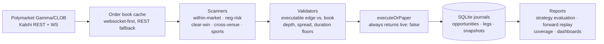

# Prediction Alpha Bot

[](https://github.com/Pablozh123/prediction-alpha-bot/actions/workflows/ci.yml)


Cross-venue and neg-risk opportunity scanner for Polymarket and Kalshi.
72 source modules, 286 tests, and 89 dated report artifacts from live paper
runs. Read-only market data throughout; no order path exists in this codebase.

## What it found

Over a ten-day run of 3,163 scan cycles, four strategies produced 4,269 raw
candidates. Four survived validation.

| Strategy | Raw found | Validated | Paper fired |
|---|---:|---:|---:|
| `within_market_fast_arb` | 2,354 | 0 | 0 |
| `within_market_yes_no_arb` | 1,554 | 0 | 0 |
| `neg_risk_bracket_arb` | 355 | **4** | 4 |
| `clear_win_watch` | 6 | 0 | 0 |

The single largest rejection reason - 1,030 of 1,206 rejections - is
`non_positive_executable_edge`: the edge existed in the quoted prices and was
gone once priced against the order book that would actually have filled it.
The largest apparent edge of the whole run (31,210 bps on an eight-leg basket)
was rejected for an unknown short-arb duration rather than taken.

The cross-venue lane read 1,000 Kalshi and 2,478 Polymarket binary markets and
matched **zero** pairs above threshold. Every near miss was a compound Kalshi
market sharing words with a single-outcome Polymarket one - exactly the
mismatches a naive title matcher would report as arbitrage.

Full detail, including the gaps this project knows about itself, in
[docs/PROJECT_STATUS.md](docs/PROJECT_STATUS.md). Dated evidence in
[docs/reports](docs/reports).

## How it works



Every candidate passes the same gauntlet: scanners find raw structure,
validators price it against real depth, and the single execution boundary
records a paper trade. Reports then check what the market did afterwards -
a scanner that never looks back is only reporting its own inputs.

## Design decisions

| Decision | Rationale |
|---|---|
| **Canonical event model for cross-venue** | Kalshi tickers and Polymarket outcomes are normalised into one event/outcome key with expected resolution time. Matching titles by words alone produced two fake edges of 79 and 64 cents in the sibling research project. |
| **Cache-first order books with per-scan telemetry** | Every scan reports how many reads were websocket, cached REST or fresh fetches, so a stale-data result is visible as such. |
| **Two-stage depth checking** | The NEG_RISK first pass reads Gamma metadata and flags candidates `needs_orderbook_depth_check`; `cleanBasketFilter` then applies depth, spread and edge floors against real books. |
| **Paper PnL only on known outcomes** | `calculatePaperPnlOnlyIfResolutionKnown` returns nothing for unresolved markets. 167 paper trades currently carry `pnl=null` - honest, not broken. |
| **Injected auth for Kalshi websockets** | The ingestor takes an auth-header provider from the caller. This repository never builds, stores or requests a credential. |

## Rescan 2026-09-04

The scanner was re-based on what the runs since May showed. Candidates are
priced against the book depth their target size would actually walk, net of
the venue fee curves (Polymarket per category, Kalshi with cent rounding,
schedule 2026-07-30), and only a basket whose net edge stays positive at the
executable size counts as a chance. Every chance carries `days_to_resolution`
and a linearly annualised return, because a gap that stands open for hours is
locked capital, not arbitrage. Every paper trade must name the candidate that
caused it. Details and the pre-registered 14-day measurement window are in
[docs/PROJECT_STATUS.md](docs/PROJECT_STATUS.md#neuaufsetzung-2026-09-04).

## Taxonomy 2026-09-05

Every candidate now carries four axes, published with their labels in the feed
and documented in [docs/ARB_TAXONOMY.md](docs/ARB_TAXONOMY.md): a class (what
the basket pays and when that payout is fixed by contract), a capital-lock
horizon (a class, no longer a rejection), an automated rule screen and a
person's rule review. Candidates pass five gates in a fixed order, structure
before executability before economics before horizon before flow control, and
are rejected for the most fundamental reason they fail; a basket that is not a
basket carries no return figures. A clean basket above the hurdle rate
(`MIN_ANNUALIZED_NET_PCT`, default five percent a year) that locks capital past
the short window is a `candidate`, carry, and is never paper-fired. Cross-venue
pairs run a four-stage protocol whose automated screen is specified in
`config/pair_screen_cases.json` and shared with the website's matcher; a pair is
hedged only after a person's `equivalent` review in `config/crossVenuePairs.json`.
The feed is schema `arb_scan/2`, a superset of the first schema.

## Quick start

```bash
npm install
npm run dev          # interval scanner loop, paper-only
npm run dev:once     # one scan cycle (plus one cross-venue pass), then exit
```

### Feed for the website

Set `ARB_PUBLISH_DIR` in `.env` to a directory outside the repository. After
every cycle, and at least every five minutes, the loop writes `arb_scan.json`
there atomically (schema `arb_scan/2`, validated before the write, no local
paths). `npm run feed:fixture -- --out <path>` writes the website's test
fixture from a seeded journal through the same publisher. Without the variable nothing is published and the start-up log says
so once. `health.alive` turns false when the last cycle is older than three
scan intervals (floor: ten minutes); that is the heartbeat the website should
watch.

### Running it permanently (Windows, no admin rights)

```powershell
npm ci
.\scripts\install_scanner_task.ps1          # registers PredictionAlphaBotScanner (at logon, restarts on crash)
Start-ScheduledTask -TaskName PredictionAlphaBotScanner
.\scripts\install_scanner_task.ps1 -Uninstall
```

The task runs `scripts\run_scanner.cmd`, a restart loop around `npm run dev`
that logs to `logs\scanner.log` with size rotation. Both scripts use paths
relative to the repository.

| Command group | Purpose |
|---|---|
| `npm run strategy:evaluate` | Funnel, edge quality, capacity and verdict per strategy |
| `npm run forward:replay` / `basket:replay` | What reported opportunities did in the following days |
| `npm run crossvenue:scan` / `crossvenue:serve` | Cross-venue scan and local dashboard |
| `npm run sports:feed` / `sports:watch` / `sports:report` | Sports websocket recording and resolution scanning |
| `npm run snapshots:once` | Expanded order book snapshot collection |
| `npm run forward:clean:start` | Isolated 24h forward run with its own DB and logs |
| `npm run coverage:report` | Snapshot coverage and near-miss quality of a dataset |
| `npm run paper:report` / `paper:resolve:batch` | Paper trade reporting and resolution against outcomes |
| `npm run paper:backfill-links` | Join legacy paper trades to their candidate, or mark them `legacy_unlinked` |
| `npm run telegram:setup` / `telegram:daily` | Optional local Telegram alerts and daily digest |
| `npm run typecheck && npm test && npm run lint` | The full local gate, identical to CI |

Scanner behaviour is configured through `.env` (see `.env.example`): fast-scan
interval, `MAX_SHORT_ARB_DURATION_HOURS=72` to block unknown or long-duration
opportunities from paper-firing, clean-basket floors for edge, depth and
spread, `PAPER_TARGET_SIZE_USD` (capital each basket targets against the
book), `MIN_EXECUTABLE_DEPTH_USD`, `EXECUTION_ROLE_MODE` (`taker` default,
`maker_first` optional), the cross-venue lane (`CROSS_VENUE_SCAN_ENABLED`,
`CROSS_VENUE_SCAN_INTERVAL_MS`) and the in-loop paper resolution
(`PAPER_RESOLVE_INTERVAL_MS`). Long-duration clean baskets stay visible in
reports as diagnostic rows.

## Paper-only status

The project does not support live trading. Every execution path routes through
a single boundary that always returns `live: false`. It contains no order
placement, private-key handling, seed phrases, wallet signing, or exchange
execution path.

Safety rules for contributors:

- Keep `.env` local and uncommitted; `.env.example` holds placeholders only.
- Never add private keys, API secrets, wallet credentials, or seed phrases.
- Never add real order placement code.
- Route every new scanner opportunity through `executeOrPaper`.
- Any live-trading implementation requires separate explicit approval first.
